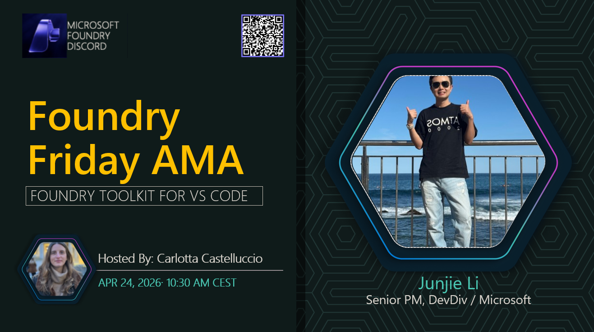

**Title:** Building Agents with Foundry Toolkit for VS Code

**Speakers:**
- Host: Carlotta Castelluccio, Sr AI Advocate at Microsoft
- Guest: Junjie Li, Sr Product Manager at Microsoft

**Description:** Explore Microsoft Foundry Toolkit and how to build and manage your agentic AI app from within your IDE.

## Topics Discussed
- Microsoft Foundry Toolkit for VS Code
- Microsoft Foundry Models
- Agentic AI development, testing and evaluation

**Links:**
- [Registration](https://aka.ms/model-mondays/discord)
