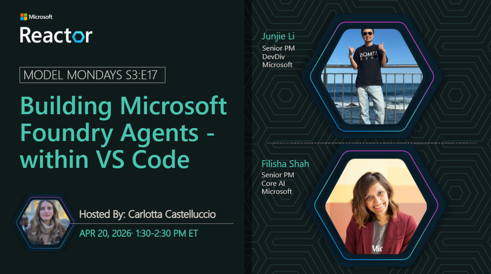
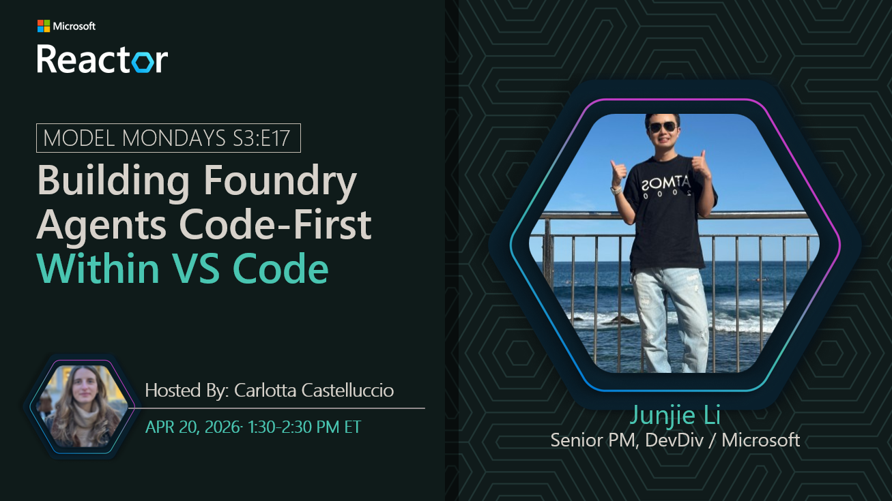
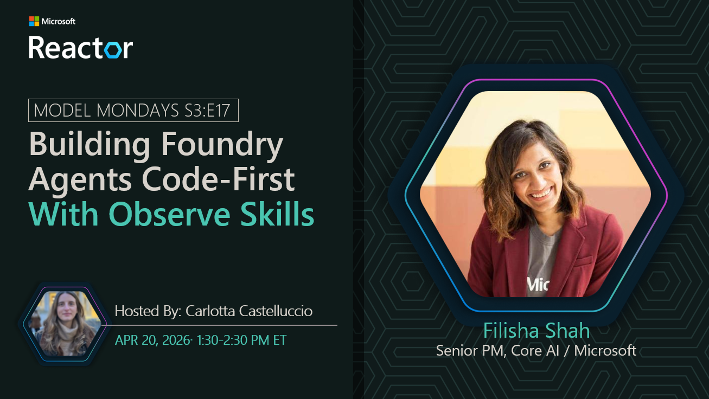

---

## Building Foundry Agents Code-First In Visual Studio Code (with GitHub Copilot)

**Date:** April 20, 2026  
**Season:** 3 | **Episode:** 17 
**Host:** [Carlotta Castellucio](https://www.linkedin.com/in/carlotta-castelluccio/)

Want to build Microsoft Foundry agentic AI solutions but don't know where to start and how to keep up with all the models, tools and best practices? What if you could get all the support you needed right in your IDE - and have a coding agent to assist you in discovering and implementing best practices?

Join us as we talk to two experts from the Core AI product teams about what's new for building Foundry Agents with VS Code.

 

### Speaker 1: Junjie Li

Join us as we talk to Junjie Li about the latest tools, features and capabilities coming to the Visual Studio Code _extensions_ ecosystem to help you plan, build, and operate, your AI agents - right from your IDE!! And learn how the seamless integration with GitHub Copilot can help accelerate and inform your developer workflows!

 

### Speaker 2: Filisha Shah

Then join us as we talk to Filisha Shah from the Core AI product team about a new preview feature - _Foundry Skills_ - available via the GitHub Copilot for Azure extension. Get a hands-on demo that shows you the power of the _observe_ skill in accelerating the inner loop with support for tracing, evaluations, data generation and more.

 

**Host:** [Carlotta Castellucio](https://www.linkedin.com/in/carlotta-castelluccio/)

_Carlotta is a Senior Developer Advocate on the Foundry Developer Relations team at Microsoft. She develops technical content, hosts skilling sessions and empowers audiences to get the most from their AI technologies._

**Resources:**
TBD

### Summary
TBD